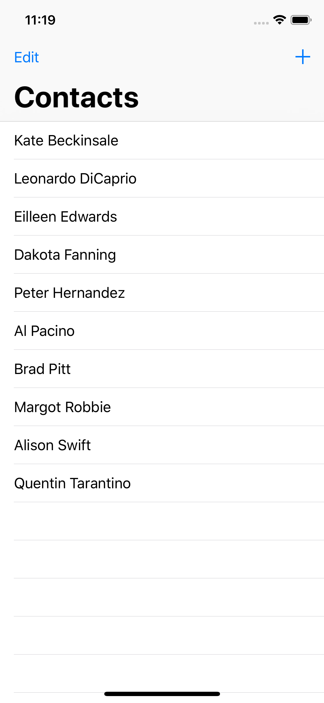
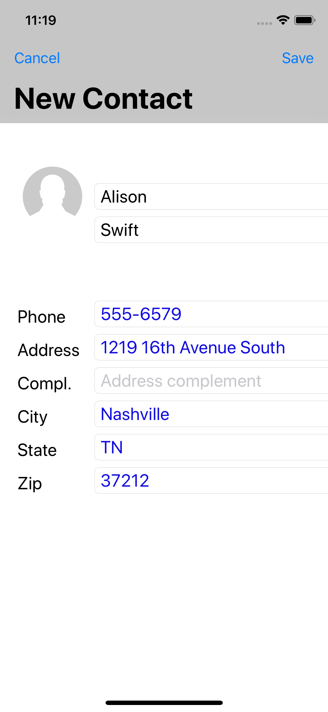
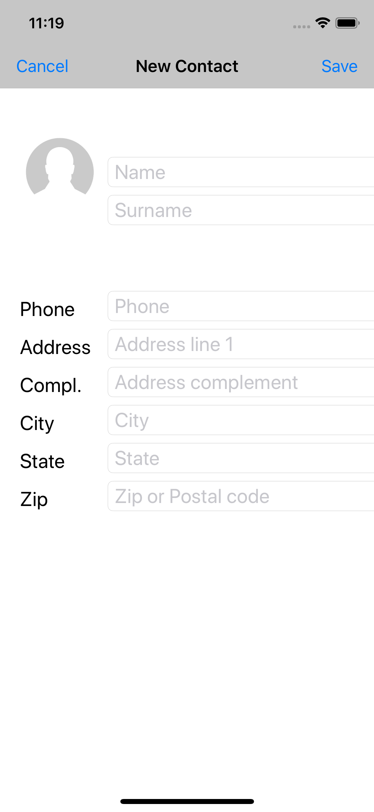

# Eleven Contacts
> Jobsity iOS code chalenge. A simple contacts app.

[![Swift Version][swift-image]][swift-url]

This simple contacts app was created to demonstrate the developer's ability to implement Swift code. The app starts with 10 contacts names implemented on JSON format and must be able to store other contacts added by the user.

<kbd></kbd>
<kbd></kbd>
 
 
<kbd></kbd>
<kbd></kbd>

## Features

- [x] UI based con native Contacts app from Apple
- [x] Display a list of contacts
- [x] Allow add, update and delete a contact

## Requirements

- iOS 12.4
- Xcode 10.3
- Swift 5.0

## Installation

No third party modules were used on this project. No additional installation is required.

## Usage

Since no external modules were used, simply open the project on Xcode and run the app on a simulator or a supported device

## Meta

Fabio Luiz  – luiz.fabio@gmail.com

[https://github.com/fluiz/jic](https://github.com/fluiz/jic)

[swift-image]:https://img.shields.io/badge/swift-5.0-orange.svg
[swift-url]: https://swift.org/